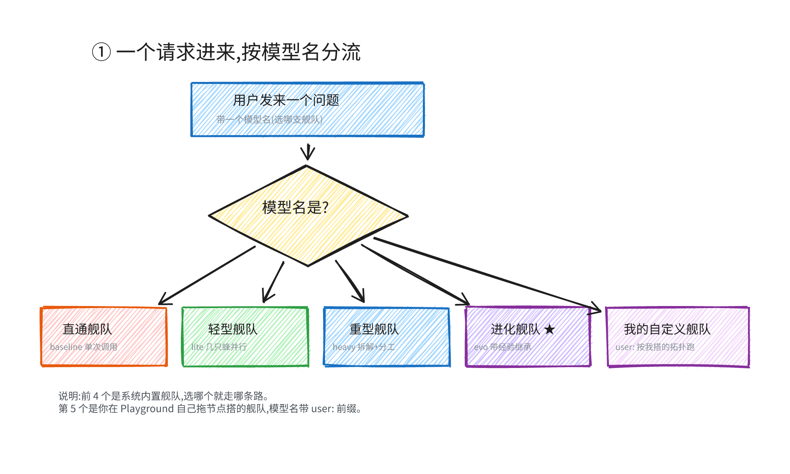
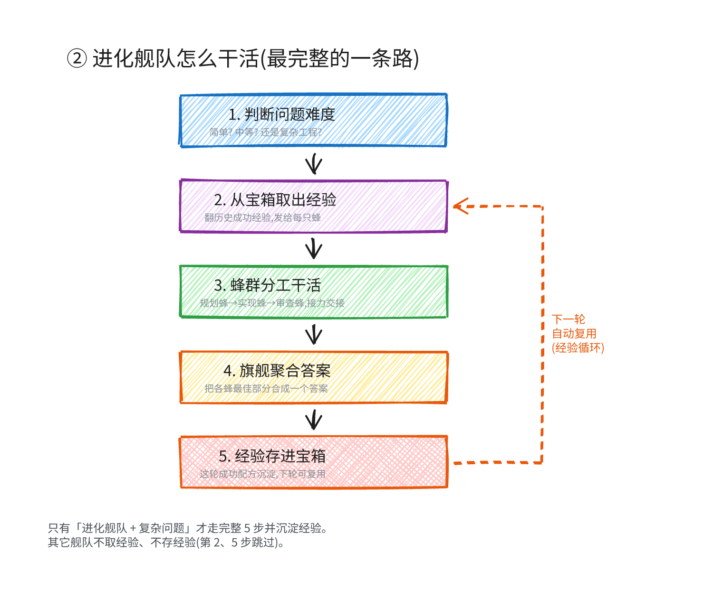
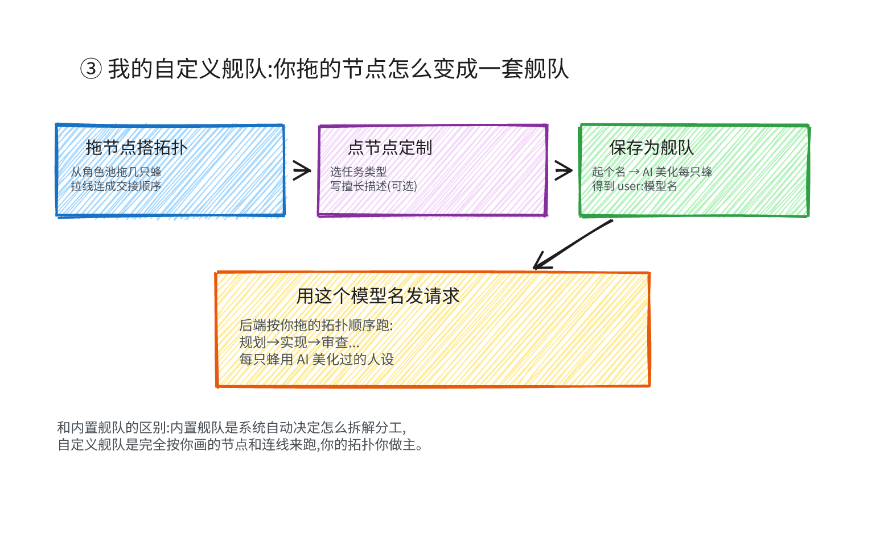
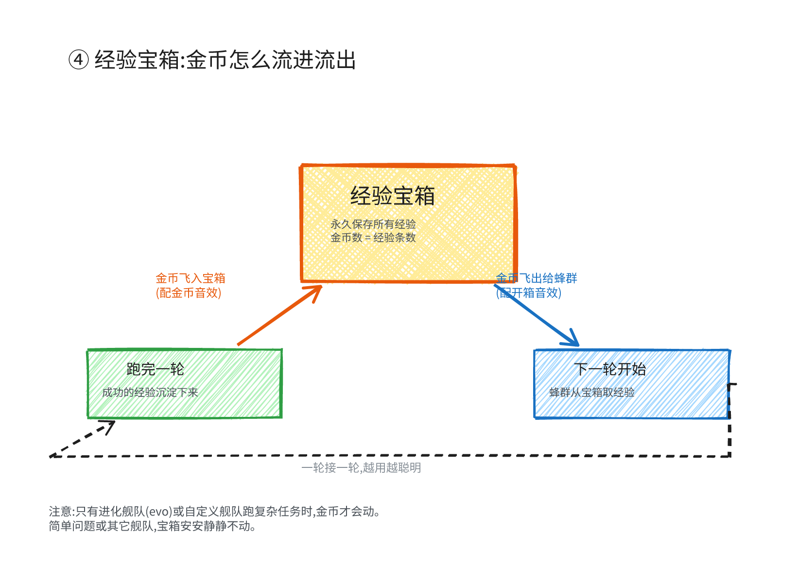

# 🐝 EvoShip — 进化星际舰队协作引擎

> 把任意 OpenAI 兼容端点**升级**成一支会自进化的蜂群舰队:每个请求背后不是单次模型调用,
> 而是一群角色化 agent **分工协作 + 突破广播 + 经验继承回流**。用得越久,经验宝箱越满,舰队越聪明。

核心论点:**弱模型蜂群 + 经验继承,能超越单次强模型调用。** 这是面向 A2A(智能体间协作)赛道的实践。

---

## 这套系统在干什么(一张图看懂)



用户发一个问题时带一个「模型名」(选哪支舰队),系统按模型名分流到 5 条路:

| 模型名 | 舰队 | 怎么干活 |
|---|---|---|
| `swarm-baseline` | 直通舰队 | 单次模型调用,不走蜂群(当对照基线) |
| `swarm-lite` | 轻型舰队 | 几只蜂并行同题多解 + 投票 |
| `swarm-heavy` | 重型舰队 | 拆解子任务 + 规划→实现→审查流水线 + 突破广播 |
| `swarm-evo` | 进化舰队 ★ | 重型 + **从经验宝箱取经验 + 完成后回流沉淀** |
| `user:你的舰队名` | 我的自定义舰队 | **完全按你在 Playground 拖的拓扑跑** |

前 4 个是内置舰队,第 5 个是你自己搭的。

---

## 进化舰队怎么干活(最完整的一条路)



只有「进化舰队 + 复杂问题」才走完整 5 步并沉淀经验。整个过程:

1. **判断难度** — 规则 + 轻量模型把问题分成简单/中等/复杂三档
2. **取经验** — 从经验宝箱翻历史成功配方,发给每只蜂当参考
3. **蜂群分工** — 复杂问题拆成 2-6 个子任务,每条线 `规划蜂 → 实现蜂 → 审查蜂` 接力;审查不过带反馈返工(最多 2 轮);谁先出突破就广播给全队
4. **聚合答案** — 旗舰把各蜂最佳部分合成一个超越单蜂的最终答案
5. **存经验** — 这轮的成功配方沉淀进经验宝箱,下轮同类问题自动复用

**关键**:简单问题(打招呼/算术)直通单次回复,中等问题(事实问答)多解交叉验证,只有复杂工程才拆解分工。不浪费算力。

---

## 我的自定义舰队:你拖的节点怎么变成舰队



和内置舰队最大的不同:**内置舰队是系统自动决定怎么拆解分工,自定义舰队是完全按你画的节点和连线来跑。**

1. **拖节点搭拓扑** — 从左侧角色池拖几只蜂到画布,拉线连成交接顺序
2. **点节点定制** — 点节点卡片触发登场动画,内联展开定制面板:
   - 选**角色类型**(旗舰/导航舰/工程舰/监察舰/斥候舰)
   - 选**场景任务**(需求分析/方案设计/编码实现/代码审查/创意发散/测试验证/文档撰写/调研总结)
   - 写**擅长描述**(自由文本,如"专门把后端 API 设计成 RESTful")
3. **保存为舰队** — 起个名,后端调 AI 给每只蜂美化人设(融合你的定制),得到一个 `user:你的舰队名` 的模型名
4. **用它发请求** — 注册端点后,用这个模型名发请求,后端按你拖的拓扑顺序真实执行,每只蜂用 AI 美化过的人设干活

自定义舰队和进化舰队一样会触发经验宝箱(跑复杂任务时取经验、存经验)。

---

## 经验宝箱:金币怎么流进流出



经验宝箱是整个系统"越用越聪明"的核心,画布左上角有个可视化宝箱:

- **金币飞入(回流)** — 跑完一轮成功的复杂任务,这轮的经验配方沉淀成金币飞进宝箱,配金币音效,宝箱抖一下 + 库存 +1
- **金币飞出(继承)** — 下一轮开始,蜂群从宝箱取出相关经验,金币从宝箱飞向蜂群,配开箱音效
- **永久累积** — 宝箱存在 SQLite 数据库,跨进程跨重启不丢,金币数 = 经验条数
- **循环** — 一轮接一轮,同类问题越解决越好(经验质量分逐代上涨)

注意:只有进化舰队或自定义舰队跑复杂任务时金币才会动。简单问题或其它舰队,宝箱安安静静不动。

---

## 几个页面分别干什么

| 页面 | 干什么 |
|---|---|
| **首页**(`/`) | 项目介绍 + **端点转换**(把你的 OpenAI 兼容端点升级成舰队端点,拿一个 `sk-evoship-` key) |
| **Playground**(`/playground`) | **核心玩法**:拖节点搭舰队、定制节点、保存舰队、派出舰队看协作过程(节点激活/边流动/粒子飞/经验宝箱金币动) |
| **对话**(`/chat`) | 像普通 AI 聊天一样发消息看舰队回答,答案下可展开「蜂群协作过程」逐条日志,**支持直通 vs 舰队对比**。从 Playground 顶栏「对话测试」一键丝滑跳转(自动带上当前舰队和问题) |
| **我的舰队**(`/my-fleets`) | 管理所有保存的自定义舰队(加载到画布/删除) |

---

## 关键概念

- **蜂群(Swarm)** — 一群角色化 agent 协作解决一个目标,不是调 N 次取最好,而是分工 + 交接 + 交叉验证
- **角色(Archetype)** — 5 种:orchestrator(旗舰/蜂后)、planner(规划)、coder(实现)、reviewer(审查)、explorer(探索)
- **六阶段协作流** — inherit(继承) → diverge(分工) → breakthrough(突破检测) → broadcast(广播) → converge(收敛) → backflow(回流)
- **经验宝箱(Treasury)** — 持久化的成功经验库,跨轮累积,质量分逐代进化
- **自定义舰队(Fleet)** — 用户在 Playground 拖出的拓扑,存成 `user:` 模型名,可复用可分享
- **handoff** — agent 间交接,上游产出作为下游上下文注入(蜂群协作的核心机制)

---

## 技术栈

- **后端**:Node.js + Express + TypeScript,OpenAI 兼容 API(`/v1/chat/completions`、`/v1/models`)
- **前端**:Vue 3 + Vue Flow(画布)+ Pinia + Vite
- **存储**:SQLite(`node:sqlite`)— 用户/会话/端点/舰队/经验记忆全持久化
- **协议**:GEP-A2A 信封(智能体间通信),可接 EvoMap 平台真实 A2A 或本地降级
- **音效**:Web Audio API 程序化合成(金币声/开箱声,无需音频文件)

---

## 项目结构

```
src/                    后端
  server.ts             入口 + 路由(/v1, /api, /oauth)
  swarm.ts              蜂群编排主流程 + trace 组装
  orchestration/
    orchestrator.ts     难度分流 + 拆解 + 自定义拓扑执行
    pipeline.ts         HARD 子任务流水线(planner→coder→reviewer)
  agents/               角色定义 + 注册表 + 绩效
  fleets.ts             用户自定义舰队存储 + AI 美化
  evolution-memory.ts   经验宝箱(SQLite 持久化)
  endpoints.ts          端点转换(OpenAI 兼容上游接入)
web/                    前端
  views/PlaygroundView.vue   画布编排 + 舰队 + 宝箱
  views/ChatView.vue         对话页
  components/playground/     PetNode(节点+定制) / ExperienceTreasure(宝箱)
  composables/               useFlowRunner(回放) / useChatRunner / useCoinSound
docs/
  evoship-flow-*.png    本文档的 4 张流程图
```

---

## 设计哲学

1. **蜂群不是投票** — 不是调 N 次取最好,而是异构分工(规划/实现/审查) + 真实交接 + 交叉验证纠错
2. **经验是复利** — 每轮成功的配方都沉淀,下轮复用,质量分逐代上涨(同目标越解决越好)
3. **用户是舰队设计师** — 不止用内置舰队,还能自己拖拓扑、定制每只蜂,完全掌控协作结构
4. **可视化即理解** — 每次协作都能在 Playground 看到节点激活、交接流动、经验金币飞舞,黑盒变白盒
